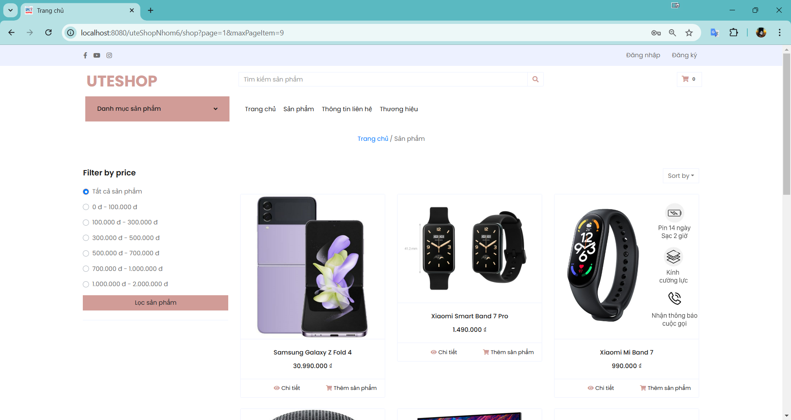
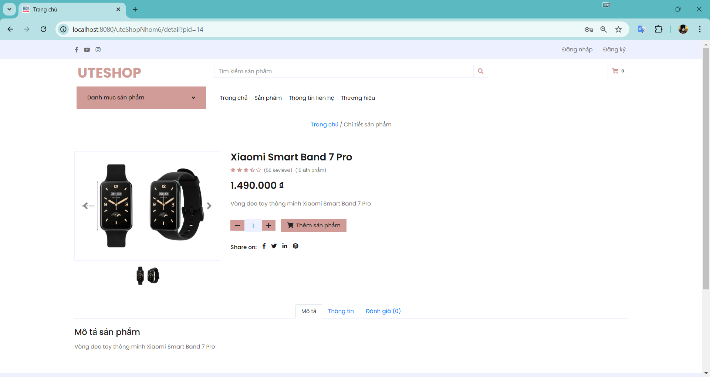
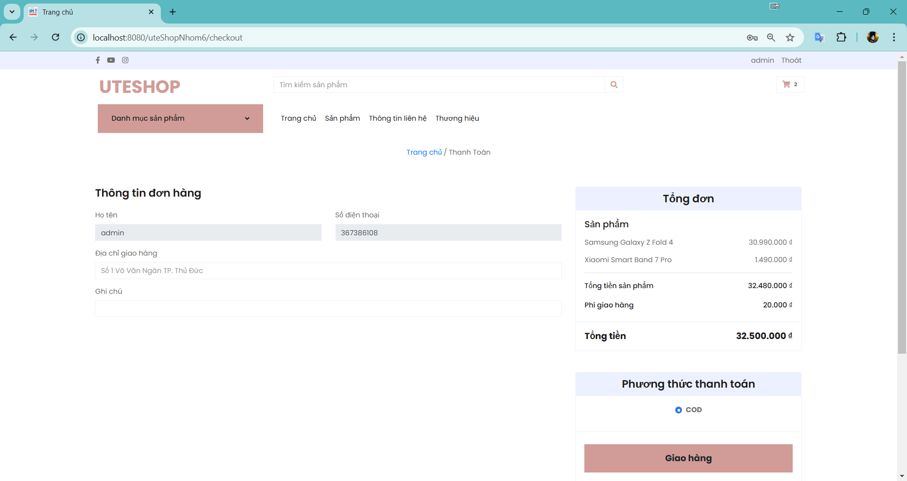
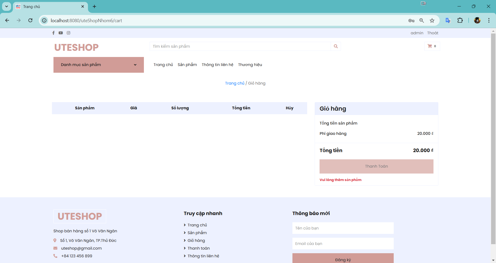
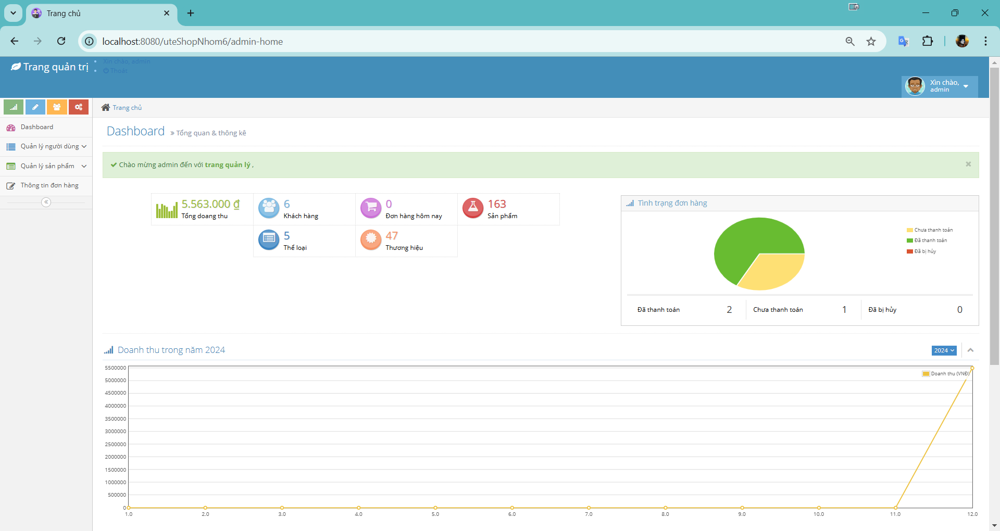

# UTEShop - Website bán hàng cho sinh viên

## Giới thiệu

UTEShop là dự án website bán hàng trực tuyến được thiết kế dành riêng cho sinh viên, với mục tiêu tạo ra một nền tảng thương mại điện tử hiện đại, đáp ứng nhu cầu mua sắm ngày càng tăng của sinh viên. 

](https://github.com/lequocvan281203/uteShopNhom6/blob/main/image/app_image/Trang chủ_1.png)  

Website được xây dựng với giao diện thân thiện, dễ sử dụng, chức năng đa dạng và bảo mật cao, mang đến trải nghiệm mua sắm trực tuyến thuận tiện và an toàn.



## Chức năng chính

**UTEShop cung cấp đầy đủ các chức năng cơ bản của một website thương mại điện tử:**

* **Đăng ký/Đăng nhập:**
  * Người dùng có thể tạo tài khoản mới hoặc đăng nhập bằng tài khoản hiện có.
  * Hỗ trợ chức năng quên mật khẩu.
* **Quản lý tài khoản:**
  * Người dùng có thể xem và cập nhật thông tin cá nhân.
  * Theo dõi lịch sử đơn hàng.
* **Danh mục sản phẩm:**
  * Hiển thị sản phẩm theo danh mục.
  * Hỗ trợ tìm kiếm và lọc sản phẩm theo nhiều tiêu chí (tên, giá, thương hiệu...).
* **Chi tiết sản phẩm:**
  * Hiển thị thông tin chi tiết về sản phẩm (hình ảnh, mô tả, giá, đánh giá...).
* **Giỏ hàng:**
  * Thêm sản phẩm vào giỏ hàng.
  * Chỉnh sửa số lượng, xóa sản phẩm trong giỏ hàng.
* **Thanh toán:**
  * Hỗ trợ nhiều phương thức thanh toán.
  * Xác nhận đơn hàng.
* **Quản lý đơn hàng:**
  * Theo dõi trạng thái đơn hàng.
  * Hủy đơn hàng (nếu cần).
* **Trang liên hệ:**
  * Cung cấp thông tin liên hệ của website.
  * Cho phép người dùng gửi phản hồi.
* **Trang quản trị (Admin):**
  * Quản lý sản phẩm (thêm, sửa, xóa).
  * Quản lý đơn hàng (xem, cập nhật trạng thái, xử lý đơn hàng).
  * Quản lý người dùng (xem, chỉnh sửa, xóa, phân quyền).
  * Quản lý danh mục sản phẩm.
  * Quản lý thương hiệu sản phẩm.
  * Xem thống kê doanh thu, báo cáo.

## Công nghệ sử dụng

* **Backend:** Java, Servlet, JSP, JPA, MySQL.
* **Frontend:** HTML, CSS, JavaScript, Bootstrap.
* **API:** RESTful API.

## Hướng dẫn cài đặt và chạy dự án

1. **Clone dự án từ Github:**
   ```bash
   git clone [https://github.com/lequocvan281203/uteShopNhom6.git](https://github.com/lequocvan281203/uteShopNhom6.git)
   ```
2. **Cài đặt MySQL:** 
   * Tạo database `uteshop`.
   * Import file `uteshop.sql` vào database.
3. **Cấu hình kết nối database:**
tạo sơ sở dữ liệu:
chạy theo thứ tự sau để tránh lỗi do ràng buộc khóa ngoại:
0. CREATE UTESHOP.sql: Tạo cơ sở dữ liệu uteshop.
1. uteshop_role.sql: Tạo bảng role.
2. uteshop_user.sql: Tạo bảng user.
3. uteshop_category.sql: Tạo bảng category.
4. uteshop_brand.sql: Tạo bảng brand.
5. uteshop_product.sql: Tạo bảng product.
6. uteshop_image.sql: Tạo bảng image.
7. uteshop_promotion.sql: Tạo bảng promotion.
8. uteshop_bill.sql: Tạo bảng bill.
9. uteshop_orderitem.sql: Tạo bảng orderitem.
11. FUNCTION.sql: Tạo các function.
12. PROCEDURE.sql: Tạo các procedure.

4. **Build và deploy dự án:**
   * Sử dụng IDE (Eclipse, IntelliJ IDEA) để build và deploy dự án lên Tomcat server.

## Thông tin nhóm

* 21110116 - Cao Nguyễn Thành An
* 21110862 - Lê Quốc Văn
* 21110187 - Nguyễn Huy

## Liên hệ

* Email: uteshop@example.com
* Facebook: fb.com/uteshop

## Hình ảnh

[](https://github.com/lequocvan281203/uteShopNhom6/blob/main/image/app_image/Trang%20ch%E1%BB%A7_1.png?raw=true)  

[](https://github.com/lequocvan281203/uteShopNhom6/blob/main/image/app_image/Trang%20ch%E1%BB%A7_2.png?raw=true)  

[](https://github.com/lequocvan281203/uteShopNhom6/blob/main/image/app_image/Trang%20ch%E1%BB%A7_3.png?raw=true)  

[[[]](https://github.com/lequocvan281203/uteShopNhom6/blob/main/image/app_image/Trang%20danh%20m%E1%BB%A5c%20s%E1%BA%A3n%20ph%E1%BA%A9m.png?raw=true)  

[](https://github.com/lequocvan281203/uteShopNhom6/blob/main/image/app_image/Trang%20chi%20ti%E1%BA%BFt%20s%E1%BA%A3n%20ph%E1%BA%A9m.png?raw=true)  

[](https://github.com/lequocvan281203/uteShopNhom6/blob/main/image/app_image/Trang%20gi%E1%BB%8F%20h%C3%A0ng.png?raw=true)  

[](https://github.com/lequocvan281203/uteShopNhom6/blob/main/image/app_image/Trang%20thanh%20to%C3%A1n.png?raw=true)  

[](https://github.com/lequocvan281203/uteShopNhom6/blob/main/image/app_image/Trang%20th%E1%BB%91ng%20k%C3%AA_1.png?raw=true)  

[](https://github.com/lequocvan281203/uteShopNhom6/blob/main/image/app_image/Trang%20th%E1%BB%91ng%20k%C3%AA_2.png?raw=true)  

[](https://github.com/lequocvan281203/uteShopNhom6/blob/main/image/app_image/Trang%20qu%E1%BA%A3n%20l%C3%BD%20ng%C6%B0%E1%BB%9Di%20d%C3%B9ng.png?raw=true)  


**Lưu ý:**

* Bạn cần thay thế `[Hình ảnh ...]` bằng các hình ảnh minh họa tương ứng.
* Bạn nên cập nhật thêm thông tin về cách sử dụng website, các chức năng nổi bật, hoặc những điểm đặc biệt của dự án để thu hút người xem.
* Đảm bảo rằng các liên kết và thông tin liên hệ trong file README.md là chính xác.

Chúc bạn hoàn thiện dự án của mình một cách tốt nhất!
